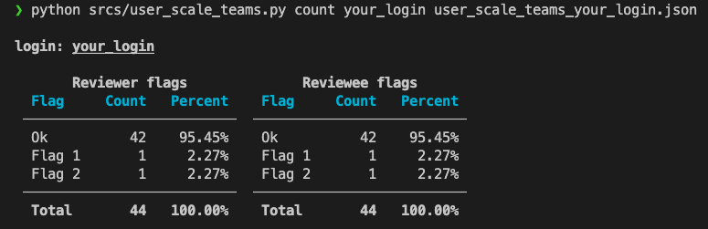

# ft-api-scripts

42 APIで遊ぶためのスクリプト集。

## 必要物

- Python >= 3.8
- Poetry

## 使い方

### インストール

1. リポジトリをclone

   ```bash
   git clone https://github.com/nafuka11/ft-api-scripts.git
   ```

1. 必要なパッケージをインストール

   ```bash
   cd ft-api-scripts
   poetry install --no-root
   ```

1. `.env` に42 APIのclient uid, secretを記載する。

   ```bash
   echo 'FT_CLIENT_UID="your_uid"' >> .env
   echo 'FT_CLIENT_SECRET="your_secret"' >> .env
   ```

### 各種スクリプト

#### login毎のレビュー数を表示するスクリプト

##### ヘルプ

```bash
poetry run python srcs/scale_teams.py -h
```

##### 例

campus_id=26, cursus_id=21,28,50のscale_teamsのデータをjsonに保存

```bash
poetry run python srcs/scale_teams.py dump --campus_id 26 --cursus_id 21 28 50
```

scale_teamsのjsonから、login毎のレビュー数をcsv出力

```bash
poetry run python srcs/scale_teams.py count scale_teams_yyyymmdd-HHMM.json
```

csvを元にヒストグラム作成

```
poetry run python srcs/scale_teams.py visualize correctors.csv
```

#### 指定loginがレビューした/された時に付けたflagを表示するスクリプト



##### ヘルプ

```bash
poetry run python srcs/user_scale_teams.py -h
```

##### 例

login=your_login, cursus_id=21,28,50のscale_teamsのデータをjsonに保存

```bash
poetry run python srcs/user_scale_teams.py dump --cursus_id 21 28 50 -- your_login
```

scale_teamsのjsonから、login=your_loginが付けた/付けられたflagを表示

```bash
poetry run python srcs/user_scale_teams.py count your_login user_scale_teams_your_login_yyyymmdd-HHMM.json
```
