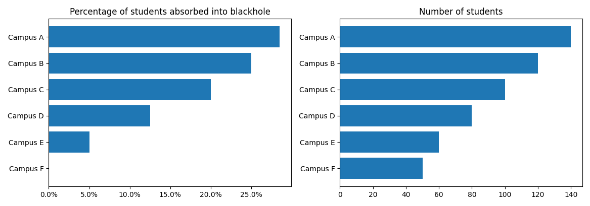

# ft-api-scripts

42 APIで遊ぶためのスクリプト集。

## 必要物

- Python >= 3.8
- [Poetry](https://python-poetry.org/docs/)
- [42 APIのUID, Secret](https://api.intra.42.fr/apidoc/guides/getting_started)

## 使い方

### インストール

1. リポジトリをclone

   ```bash
   git clone https://github.com/nafuka11/ft-api-scripts.git
   ```

1. 必要なパッケージをインストール

   ```bash
   cd ft-api-scripts
   poetry install --no-root
   ```

1. `.env` に42 APIのclient UID, Secretを記載する。

   `.env.example` を `.env` としてコピーし、
   ```bash
   cp .env.example .env
   ```
   `.env` 内の `your_uid` と `your_secret` をご自身のUID, Secretに書き換えてください。

## 各種スクリプト

### login毎のレビュー数を表示するスクリプト

#### ヘルプ

```bash
poetry run python srcs/scale_teams.py -h
```

#### dump

campus_id=26, cursus_id=21,28,50のscale_teamsのデータをjsonに保存

```bash
poetry run python srcs/scale_teams.py dump --campus_id 26 --cursus_id 21 28 50
```

#### count

scale_teamsのjsonから、login毎のレビュー数をcsv出力

```bash
poetry run python srcs/scale_teams.py count scale_teams_yyyymmdd-HHMM.json
```

#### visualize

csvを元にヒストグラム作成

```
poetry run python srcs/scale_teams.py visualize correctors.csv
```

### 指定loginがレビューした/された時に付けたflagを表示するスクリプト


#### ヘルプ

```bash
poetry run python srcs/user_scale_teams.py -h
```

#### dump

login=your_login, cursus_id=21,28,50のscale_teamsのデータをjsonに保存

```bash
poetry run python srcs/user_scale_teams.py dump --cursus_id 21 28 50 -- your_login
```

#### count

scale_teamsのjsonから、login=your_loginが付けた/付けられたflagを表示

```bash
poetry run python srcs/user_scale_teams.py count your_login user_scale_teams_your_login_yyyymmdd-HHMM.json
```

### 各campusのBH率と学生数を表示するスクリプト



#### ヘルプ

```bash
poetry run python srcs/campus.py -h
```

#### dump

cursus_id=21, range[begin_at]="2021-01-01T00:00:00.000Z,2042-12-31T23:59:59.999Z" の cursus_users のデータを取得
```bash
poetry run python srcs/campus.py dump --cursus_id 21 --begin_at 2021-01-01T00:00:00.000Z 2042-12-31T23:59:59.999Z
```
- 以下のファイルが出力されます。
  - `campus.json`
  - `cursus_users_cursusid_{cursusid}_campusid_{campusid}.json`

#### count

`cursus_users_cursusid_21_campusid_*.json` からBH率をカウントする
```bash
poetry run python srcs/campus.py count data/campus.json data/cursus_users_cursusid_21_campusid_*.json
```
- 以下のファイルが出力されます。
  - `campus_blackholed.csv`
    - begin_atが現在より前の学生の中で、blackholed_atまたはend_atが現在より前の学生を、BHに吸い込まれた扱いにしています。


#### visualize

`campus_blackholed.csv` からBH率と学生数を表示する
```bash
poetry run python srcs/campus.py visualize data/campus_blackholed.csv
```
- 学生数が15より多いcampusを表示します。

### 指定campus_id, cursus_idのevents一覧をcsvファイルに保存するスクリプト

#### ヘルプ

```bash
poetry run python srcs/events.py -h
```

campus_id=26, cursus_id=21, event名に `AMA` を含むイベントをcsvファイルに保存

```bash
poetry run python srcs/events.py 26 21 --name AMA
```
